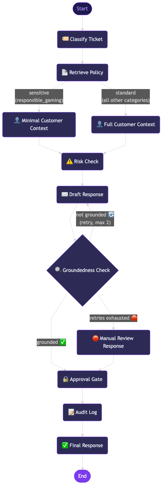
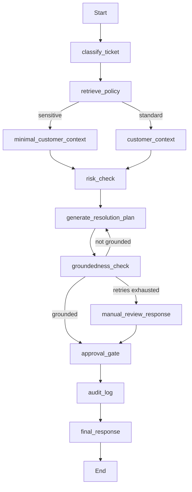

# Customer Support Resolution Copilot

> An AI-powered support workflow copilot using LangGraph, LangChain, RAG, and MCP to classify support cases, retrieve policy guidance, draft grounded responses, flag sensitive issues, and enforce human approval before customer-facing actions.

---

## Architecture

```
Support Agent UI (Streamlit)
      │
      ▼
Customer message + Customer ID
      │
      ▼
LangGraph Workflow
      │
      ├── Classify Ticket (structured output)
      ├── Retrieve Policy (RAG with category filtering → ChromaDB)
      ├── Customer Context ──→ MCP Client
      │     │                    └── MCP Support Server
      │     │                          ├── get_customer_profile (tool)
      │     │                          ├── get_ticket_history (tool)
      │     │                          ├── get_recent_transactions (tool)
      │     │                          ├── get_bonus_status (tool)
      │     │                          └── policy:// (resources)
      │     └── (full or minimal for sensitive cases)
      ├── Risk Check (rule-based risk assessment)
      ├── Generate Resolution Plan (draft + recommendation)
      ├── Groundedness Check (dual: draft + recommendation)
      │     ├── Grounded → Approval Gate
      │     ├── Not grounded → Retry (max 2)
      │     └── Retries exhausted → Manual Review Response
      ├── Approval Gate (human-in-the-loop)
      ├── Audit Log (consolidated summary)
      └── Final Response
      │
      ▼
Audit trail + LangSmith trace
```

## LangGraph Workflow





### Key design decisions

- **Conditional routing**: Responsible gaming cases fast-track through minimal context to prioritise safety over deep analysis.
- **Dual groundedness check**: Both the customer-facing draft and the internal recommendation are verified against policy before approval.
- **Manual review fallback**: If the LLM cannot produce a grounded response after 2 retries, a safe templated response is used instead.
- **PII masking**: Customer names and emails are masked in the final output and audit trail.

---

## What This Project Demonstrates

| Capability | Implementation |
|---|---|
| Structured classification | `TicketClassification` with 7 Literal categories via `with_structured_output` |
| RAG | ChromaDB vector store with markdown section-aware chunking and category metadata filtering |
| Tool calling | 5 LangChain tools for customer, ticket, transaction, bonus, and policy lookup |
| MCP | MCP server exposing tools + policy resources, connected via stdio client with langchain-mcp-adapters |
| Risk assessment | Rule-based engine with 5 priority-ordered risk rules |
| Response generation | Separate chains for customer draft (what to SAY) and internal recommendation (what to DO) |
| Groundedness checking | LLM-based verification of both outputs against policy context |
| Human-in-the-loop | Approval gate that blocks customer-facing actions pending human review |
| Audit trail | Every node logs step name, timestamp, and key metadata |
| Evaluation framework | 25 eval cases, 5 evaluation dimensions, weighted aggregate scoring |
| Separation evals | 5 evaluators checking draft vs recommendation boundaries |
| LangSmith tracing | Full graph tracing when enabled via environment variables |

---

## Example Scenarios

### 1. Failed Withdrawal (CUST-1001)

> "I tried to withdraw €300 three times and it keeps failing."

- **Category**: withdrawal_issue | **Urgency**: high | **Sentiment**: negative
- **Risk**: high - 3 failed withdrawals + negative sentiment
- **Recommendation**: Escalate to Payments Operations, check payment provider status
- **Draft**: Empathetic tone, does not claim issue is resolved
- **Status**: Pending review (human approval required)

### 2. Self-Exclusion Request (CUST-1006)

> "I want to take a break from gambling."

- **Category**: responsible_gaming | **Urgency**: high | **Sensitive**: yes
- **Path**: Minimal context (fast-tracked, no transaction lookup)
- **Recommendation**: Immediate Responsible Gaming team review
- **Status**: Pending review (mandatory for all responsible gaming cases)

### 3. Bonus Not Applied (CUST-1004)

> "I signed up with WELCOME100 promo code but my bonus was not credited."

- **Category**: bonus_issue | **Urgency**: medium | **Sentiment**: negative
- **Recommendation**: Check bonus eligibility, verify promo code, check wagering status
- **Status**: May auto-approve if low risk

---

## Policy RAG

7 markdown policy documents are ingested into ChromaDB:

| Policy | Categories |
|---|---|
| `withdrawal_policy.md` | withdrawal_issue |
| `deposit_policy.md` | deposit_issue |
| `bonus_policy.md` | bonus_issue |
| `login_policy.md` | login_issue |
| `account_verification_policy.md` | account_verification |
| `responsible_gaming_policy.md` | responsible_gaming |
| `escalation_policy.md` | all categories |

**Chunking**: Split by markdown headings (not character count) so each chunk is a complete section with source and heading prefix.

**Retrieval**: Category metadata filtering first, with automatic fallback to unfiltered search.

---

## Tools

| Tool | Type | Description |
|---|---|---|
| `get_customer_profile` | Read-only | Customer profile, status, risk level, flags |
| `get_recent_transactions` | Read-only | Deposits, withdrawals, failed attempts |
| `get_ticket_history` | Read-only | Past and open support tickets |
| `get_bonus_status` | Read-only | Active bonuses, wagering progress |
| `search_policy_documents` | Read-only | RAG search over policy corpus |

The agent can **recommend** and **draft** but never execute dangerous actions (send messages, close accounts, issue refunds) without approval.

---

## MCP Server

The project includes a **Model Context Protocol (MCP) server** that exposes customer support data as a standard context interface. The LangGraph agent connects to it via an MCP client, demonstrating the MCP pattern for tool and resource access.

### MCP Tools (executable functions)

| Tool | Description |
|---|---|
| `get_customer_profile` | Customer profile, status, risk level, flags |
| `get_ticket_history` | Past and open support tickets |
| `get_recent_transactions` | Deposits, withdrawals, failed attempts |
| `get_bonus_status` | Active bonuses, wagering progress |

### MCP Resources (contextual data)

| URI | Description |
|---|---|
| `policy://list` | List all available policy documents |
| `policy://{filename}` | Retrieve a specific policy document by name |

### How it connects

```
LangGraph node (customer_context)
      │
      ▼
  MCP Client (mcp_server/client.py)
      │ stdio
      ▼
  MCP Server (mcp_server/server.py)
      │
      ├── Tools → storage/mock_data.py
      └── Resources → data/policies/*.md
```

Run the MCP server standalone:
```bash
uv run python mcp_server/server.py                        # stdio
uv run python mcp_server/server.py --transport http --port 8100  # HTTP
```

---

## Approval Gate

The copilot stops before any customer-facing action:

```
Proposed action: Send draft response to CUST-1001
Risk level: high
Human review required: yes

[✅ Approve]  [❌ Reject]
```

- **Approve** → Message would be sent, ticket status updated
- **Reject** → Draft saved for manual review, case escalated to specialist

This is one of the most important features - it shows safe agent design.

---

## Evaluation

### Dataset
25 evaluation cases covering all 6 issue types plus edge cases.

### Dimensions (weighted aggregate)
| Dimension | Weight | Description |
|---|---|---|
| Classification accuracy | 0.25 | Category, urgency, sentiment match |
| Policy retrieval | 0.20 | Correct policy source in results |
| Sensitivity detection | 0.20 | Human review flag accuracy |
| Response quality | 0.20 | Keyword presence/absence in draft |
| Keywords | 0.15 | Key terms in classification summary |

### Separation evals
| Check | Description |
|---|---|
| `draft_is_customer_safe` | No forbidden phrases or internal language in draft |
| `recommendation_is_internal` | Action verbs present, not customer-facing text |
| `no_unconfirmed_actions` | Neither output claims completed actions |
| `missing_info_quality` | Populated and specific, not empty |
| `approval_correctness` | Matches expected review decision |

Run evals:
```bash
uv run python -m evals.run_evals                    # full suite
uv run python -m evals.run_evals --category withdrawal_issue
uv run python -m evals.run_evals --question q01
uv run python -m evals.run_evals --output results.json
```

---

## Setup

### Prerequisites
- Python 3.12+
- [uv](https://docs.astral.sh/uv/getting-started/installation/) package manager
- OpenAI API key

### Installation

```bash
# Clone the repository
git clone <repo-url>
cd customer-support-agent

# Install dependencies
uv sync

# Configure environment
cp .env.example .env
# Edit .env and add your OPENAI_API_KEY
```

### Run

```bash
# CLI - run all 6 demo scenarios
uv run python main.py

# Streamlit UI
uv run streamlit run app.py

# Tests
uv run pytest -v

# Linting
uv run ruff check .
```

### LangSmith tracing (optional)

Set these in your `.env` to enable tracing:

```
LANGCHAIN_TRACING_V2=true
LANGCHAIN_API_KEY=your-langsmith-api-key
LANGCHAIN_PROJECT=customer-support-copilot
```

---

## Project Structure

```
customer-support-agent/
├── app.py                          # Streamlit UI
├── main.py                         # CLI entry point
├── pyproject.toml                  # Dependencies (managed by uv)
├── .env.example                    # Environment variable template
│
├── data/
│   ├── policies/                   # 7 markdown policy documents
│   └── mock/                       # Mock customer/ticket/transaction data
│
├── models/
│   ├── classification.py           # TicketClassification
│   ├── recommendation.py           # SupportRecommendation
│   └── response.py                 # DraftResponse
│
├── graph/
│   ├── state.py                    # GraphState TypedDict
│   ├── consts.py                   # Node name constants
│   ├── graph.py                    # LangGraph workflow assembly
│   ├── nodes/                      # 11 graph nodes
│   │   ├── classify_ticket.py
│   │   ├── retrieve_policy.py
│   │   ├── customer_context.py
│   │   ├── minimal_customer_context.py
│   │   ├── risk_check.py
│   │   ├── generate_resolution_plan.py
│   │   ├── groundedness_check.py
│   │   ├── manual_review_response.py
│   │   ├── approval_gate.py
│   │   ├── audit_log.py
│   │   └── final_response.py
│   └── chains/                     # LLM chains
│       ├── classifier.py
│       ├── response_generator.py
│       ├── recommendation_generator.py
│       └── groundedness_checker.py
│
├── tools/                          # LangChain tools
│   ├── registry.py
│   ├── customer_tools.py
│   ├── ticket_tools.py
│   └── policy_tools.py
│
├── storage/
│   ├── mock_data.py                # JSON data loading
│   ├── vector_store.py             # ChromaDB policy store
│   └── pii.py                      # PII masking utilities
│
├── mcp_server/
│   ├── server.py                   # MCP server (tools + resources)
│   └── client.py                   # MCP client wrapper
│
├── evals/
│   ├── dataset.py                  # 25 evaluation cases
│   ├── evaluators.py               # 5 evaluation dimensions
│   ├── separation_evals.py         # Draft vs recommendation boundary checks
│   └── run_evals.py                # CLI evaluation runner
│
├── tests/                          # 159+ tests
│   ├── test_schemas.py
│   ├── test_tools.py
│   ├── test_policy_retrieval.py
│   ├── test_risk_rules.py
│   ├── test_graph.py
│   └── test_evals.py
│
└── docs/
    ├── graph.mmd                   # Mermaid diagram source
    └── graph.png                   # Rendered workflow diagram
```

---

## Limitations

- **Mock data only** - no real customer database or support system integration
- **Mock action execution** - approve/reject is simulated, no real ticket creation
- **No real-time ingestion** - policy documents are static markdown files
- **No authentication** - no user roles or access control in the UI
- **PII masking is best-effort** - uses pattern-based masking, not a full PII detection system

---

## Tech Stack

| Component | Technology |
|---|---|
| Workflow orchestration | LangGraph |
| LLM framework | LangChain |
| LLM provider | OpenAI (gpt-4o-mini) |
| Structured output | Pydantic |
| Vector store | ChromaDB |
| Tracing | LangSmith |
| UI | Streamlit |
| Testing | pytest |
| Linting | Ruff |
| Package management | uv |
| MCP | mcp + langchain-mcp-adapters (FastMCP server, stdio client) |
